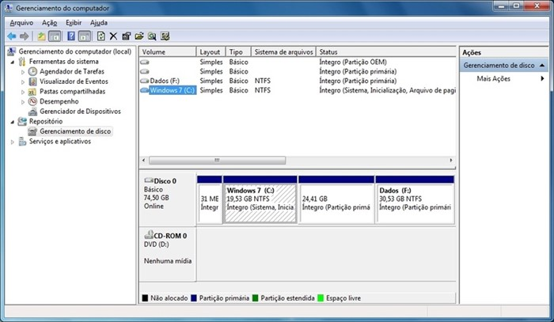
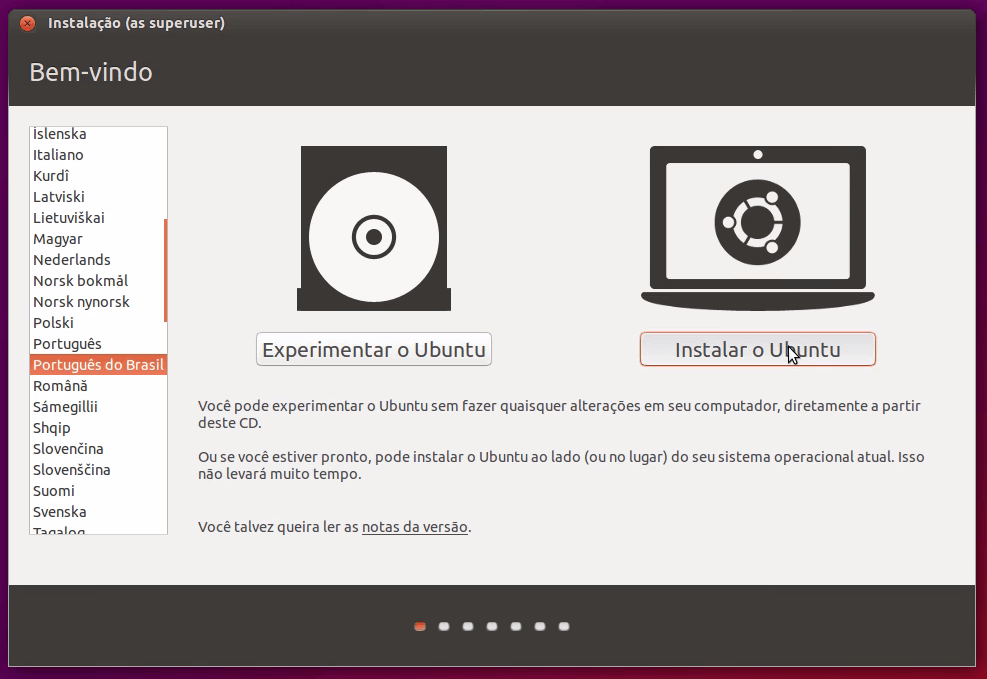
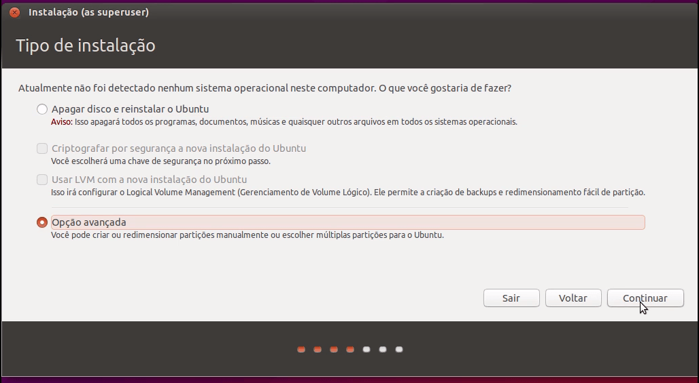
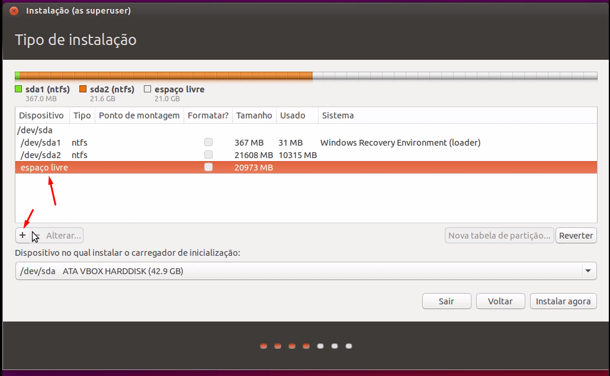
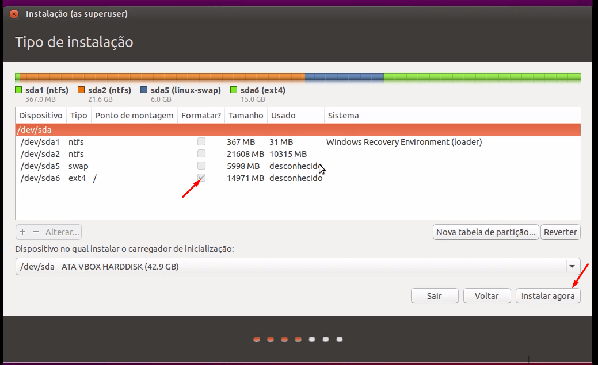
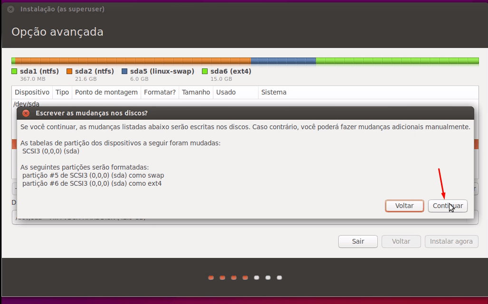
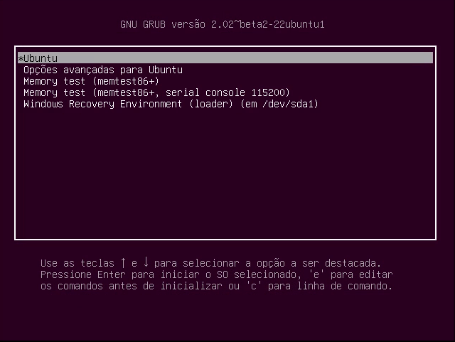

<h1>Instalar ubuntu dual boot!</h1>

1º passo: com o windows em funcionamento acesse o gerenciador de disco deixe uma parte do disco Não alocado ou reservada para realizar a instalação do ubuntu.

2º Passo: insira o disco com ubuntu ou pen drive bootavel e reinicie o pc.

3º Passo: Após reiniciar entre no processo de instalação e clique em instalar.

4º Passo: Siga  a instalação, selecione opção avançada.

5º Passo: Selecione a partição livre e clique no +.

6º Passo: configure como mostra a imagem (obs: o espaço swap é opcional).

7º Passo: Verifique se a partição que você escolheu por último (para a raiz) está selecionada e dê continuidade à instalação.

8º Passo: Confirme as mudanças.

10º Passo: Siga os passos da instalação normalmente.

11º Passo: Após terminada a instalação e reiniciado o pc, deverá cair nessa tela de seleção. Basta escolher o sistema para inciar.

